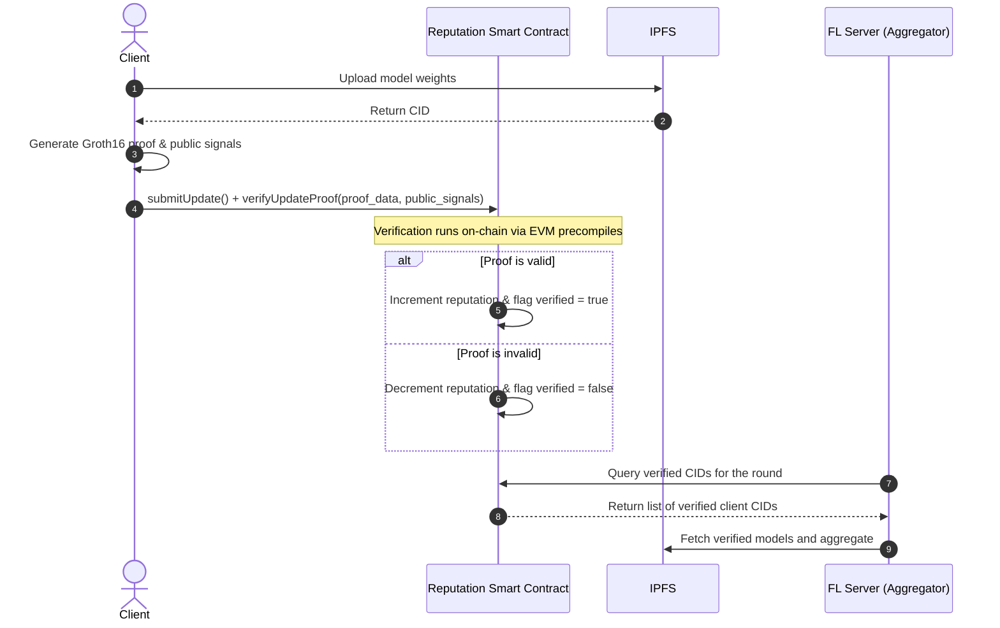

# Thesis Upgrade Proposals: FL + Blockchain + ZKP System

This document outlines several potential research directions, architectural upgrades, and experimental ideas to transform this repository into a rigorous, publishable Master's or Ph.D. thesis. 

---

## Thesis Upgrade Directions at a Glance

| Theme | Difficulty | Key Research Questions | Upgraded Capabilities |
| :--- | :---: | :--- | :--- |
| **1. True Trustless Verification** | Medium | *Can we eliminate server bias and verify updates without a trusted mediator?* | On-chain Groth16 proof validation; automated smart contract reputation. |
| **2. Privacy-Preserving ZK-FL** | High | *How do we defend against gradient inversion while ensuring clients didn't send garbage data?* | Zero-Knowledge proofs over encrypted updates (Homomorphic Encryption + ZKP). |
| **3. verifiable Training Correctness** | High | *Can a client prove they ran the actual training loop and didn't cheat the learning process?* | Circom circuit verifying a single SGD step or local loss reduction. |
| **4. Game-Theoretic Incentive & Slashing** | Medium | *How do we financially disincentivize poisoning in decentralized federated systems?* | Stake-and-slash smart contract, tokenized reputation, Shapley value payout. |
| **5. Robust Byzantine Defense Benchmark** | Low-Med | *How does our reputation system hold up against advanced, coordinated backdoor attacks?* | Attack framework expansion (Sybil, backdoor); Krum/Bulyan defense comparison. |

---

## 1. True Trustless Verification (On-Chain Groth16)

### Current Limitation
Currently, the client uploads proof parameters to the server, and the server validates them off-chain by calling a REST endpoint on the `zkp-node` helper. If the server is malicious or compromised, it can falsely mark honest updates as invalid or accept invalid updates.

### Proposed Upgrade
Fully activate the on-chain verifier. Clients submit their updates and proof parameters directly to the smart contract using [verifyUpdateProof](file:///C:/Users/NRN9HC/Documents/devops-link-task/FL-deployment-test/Project_NT114/contracts/Reputation.sol#L102-L145). The smart contract performs the elliptic curve pairings to verify the Groth16 proof on-chain and updates reputation state variables directly.

### Thesis Value
*   **Security Contribution**: Establishes a zero-trust architecture where the aggregator cannot manipulate the validation outcomes.
*   **Performance Analysis**: You can benchmark EVM gas costs of verifying ZKP proofs on-chain vs. Layer-2 solutions (e.g., Arbitrum, Optimism) or ZK-rollups.

---

## 2. Privacy-Preserving ZK-FL (Secure Aggregation + ZKP)

### Current Limitation
The server must see the raw model updates in plaintext to calculate the cosine similarity and weight deltas in [evaluate_clients](file:///C:/Users/NRN9HC/Documents/devops-link-task/FL-deployment-test/Project_NT114/reputation.py#L67-L146). This violates the privacy premise of FL, as raw gradients can be inverted (e.g., Deep Leakage from Gradients) to reconstruct the client's local private dataset.

### Proposed Upgrade
Combine **Additive Secret Sharing** or **Functional/Homomorphic Encryption** with ZKPs. 
1. Clients encrypt or mask their model updates before sending them to the aggregator.
2. The aggregator homomorphically sums the updates without decrypting individual client updates.
3. **The ZK constraint**: The client generates a proof showing that *the plaintext inside the encrypted payload* has a norm below the threshold (`norm_bound`). This prevents a malicious client from injecting massive noise or out-of-bound values that poison the homomorphic sum.

### Thesis Value
*   **Novelty**: Resolves a classic conflict in FL research: *How do you keep client updates private (via encryption) while still validating that the updates are not malicious (which usually requires inspection)?*
*   **Evaluation**: Analyze the computational overhead of generating ZKPs over encrypted inputs versus security bounds.

---

## 3. Verifiable Training Correctness (ZKP over SGD)

### Current Limitation
The current circuit ([prove_gradient_norm.circom](file:///C:/Users/NRN9HC/Documents/devops-link-task/FL-deployment-test/Project_NT114/prove_gradient_norm.circom)) only proves that the update has a small norm. A client can easily cheat by sending all zeros or a static vector that fits the bound, completely skipping the training step (Free-rider attack) or introducing subtle, low-norm poison.

### Proposed Upgrade
Create a ZK circuit that verifies a single step of Gradient Descent (or a highly compressed version of it).
*   **Input**: Global model weights $W_t$, local training data batch $X, Y$, learning rate $\eta$, and local model weights $W_{t+1}$ (private).
*   **Proof Statement**: Proves that $W_{t+1} = W_t - \eta \cdot \nabla \mathcal{L}(W_t, X, Y)$ and that the hash of the dataset $(X, Y)$ matches a pre-committed data root (e.g., a Merkle tree root of the client's dataset).
*   **Optimization**: Because proving deep training in ZK is highly expensive, you can use *ZK-friendly model layers* (e.g., quantized weights, linear activations) or only verify the last layer of the network.

### Thesis Value
*   **Novelty**: Moves from "reputation-based guessing" of update validity to mathematical verification of correct execution of the training algorithm.

---

## 4. Game-Theoretic Incentive & Slashing Mechanism

### Current Limitation
The reputation system simply lowers a client's priority score. There is no financial or resource-based penalty, meaning an attacker can spawn endless free Sybil nodes to try and manipulate the aggregation.

### Proposed Upgrade
Design and implement an on-chain token economy (Tokenomics) with stake-and-slash constraints:
*   **Staking**: Clients must deposit tokens (e.g., test-ETH or a custom token) into the smart contract to register.
*   **Dynamic Rewards**: Rewards are distributed using a **Shapley Value** or **Influence-based** metric derived from [evaluate_clients](file:///C:/Users/NRN9HC/Documents/devops-link-task/FL-deployment-test/Project_NT114/reputation.py#L67-L146) to reward highly cooperative, high-quality nodes.
*   **Slashing**: If a client fails ZKP verification, or is flagged as an outlier (violating the IQR threshold) for $N$ consecutive rounds, the contract slashes their staked deposit.
*   **Dispute Resolution**: Introduce a decentralized audit step. If a client is flagged as a malicious outlier, a committee of random clients can be chosen to decrypt and audit the update, resolving disputes trustlessly.

### Thesis Value
*   **Interdisciplinary Contribution**: Blends game theory, economics, and distributed systems.
*   **Analytical Proofs**: You can prove the system's economic resilience to "Rational Adversaries" (i.e., proving that the cost of attacking exceeds any potential gain).

---

## 5. Comprehensive Byzantine Attack & Defense Benchmarking

### Current Limitation
The current system only tests noise-based poisoning and invalid ZKP proofs. In actual deployments, adversaries use highly sophisticated evasion techniques.

### Proposed Upgrade
Transform the testing pipeline into a standard benchmark for FL defenses:
1.  **Implement Advanced Attacks**:
    *   **Sybil Attack**: Multiple client pods coordinate to simulate honest-looking updates that slowly drift the IQR median.
    *   **Targeted Backdoor Attack**: The adversary alters a small subset of labels (e.g., putting a small sticker on EMNIST digits) to trigger misclassification of specific target inputs while maintaining high validation accuracy for normal inputs.
    *   **Collusion Attack**: Poisoners collaborate to stay just inside the IQR boundary but pull the model in a target direction.
2.  **Implement Alternative Defensive Aggregators**:
    *   Compare the custom reputation strategy against baseline algorithms like **Multi-Krum**, **Trimmed Mean**, **Bulyan**, and **RFA (Robust Federated Aggregation)**.
3.  **Metrics**: Plot defense execution times, attack success rate (ASR), and global model convergence speed under varying percentages of compromised nodes (e.g., 10% to 49%).

### Thesis Value
*   **Experimental Rigor**: Provides concrete empirical evidence of the system's resilience under standard adversarial ML frameworks. Highly valuable for publication in security and machine learning venues.

---

## Recommended Next Steps for Your Thesis Roadmap

1.  **Phase 1 (Low-hanging Fruit)**: Integrate the on-chain Groth16 verifier (`verifyUpdateProof` transaction) and document the gas overhead.
2.  **Phase 2 (ML Rigor)**: Build out the advanced attacks (Sybil and Backdoors) to challenge the current IQR and Reputation defense.
3.  **Phase 3 (Privacy / Math)**: Introduce differential privacy or additive secret sharing to hide individual gradients, using ZKP to defend the ciphertext space.
